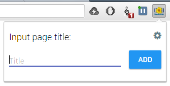

# MediaWiki Page adder

You can easily add pages to your wiki from any page.

# Languages support
* English
* Russian

# Info

* Show popup shortcut: ctrl+shift+7
* Extension sources: /app/ folder
* Fonts, icons sources: /sources/ folder

# Install

* You can install it from dev mode in chrome
* Or from [Chrome Store](https://chrome.google.com/webstore/detail/gknagelhdlggklkeifcgeabapphikehg/)